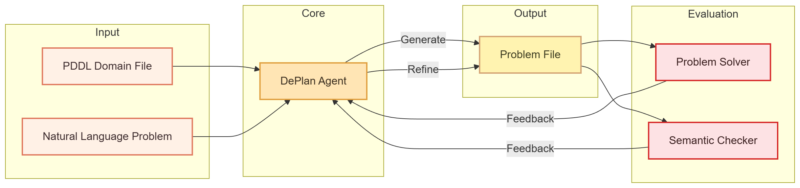

# DePlan: LLM-based PDDL Planning

## Architecture



## Project Structure

```
DePlan/
├── agents/
│   └── deplan/                # DePlan agent
│       ├── agent.py           # DePlanAgent implementation
│       ├── prompts.py         # Prompt templates
│       └── tools.py           # Tool definitions (empty for now)
├── envs/
│   └── pddl/                  # PDDL environment
│       ├── env.py             # PDDLEnv implementation
│       └── domains/           # PDDL domain files
├── base/                      # Base abstract classes
│   ├── agent.py               # Agent base class
│   └── environment.py         # Environment base class
├── utils/                     # Utility modules
│   ├── common.py              # Common utilities
│   ├── errors.py              # Custom error definitions
│   ├── executor.py            # Async execution utilities
│   ├── llm.py                 # LLM client wrapper
│   ├── logger.py              # Logging utilities
│   ├── mockllm.py             # Mock LLM for testing
│   ├── pddl_loader.py         # PDDL file loader
│   ├── pddl_solver.py         # Fast-Downward wrapper
│   └── pddl_utils.py          # PDDL parsing utilities
├── configs/                   # LLM configurations
│   ├── prices.json            # API pricing data
│   ├── profiles.yaml          # User LLM profiles
│   └── profiles_example.yaml  # Example configuration
├── Scripts/                   # Test scripts
├── support/
│   └── downward-release-22.06.1/  # Fast-Downward solver
├── run.py                     # Unified entry point
└── requirements.txt           # Python dependencies
```

## Quick Start

### 1. Install Dependencies

```bash
pip install -r requirements.txt
```

### 2. Setup Fast-Downward Solver

DePlan requires the Fast-Downward planner to solve PDDL problems.

**Download and Setup**:

```bash
# Download Fast-Downward (version 22.06.1 recommended)
mkdir -p support && cd support
wget https://github.com/aibasel/downward/releases/download/release-22.06.1/downward-release-22.06.1.tar.gz
tar -xzf downward-release-22.06.1.tar.gz
cd downward-release-22.06.1
./build.py
```

**Expected Directory Structure**:
```
DePlan/
└── support/
    └── downward-release-22.06.1/
        ├── fast-downward.py
        ├── builds/
        └── ...
```
### 3. Configure LLM

Create `configs/profiles.yaml` based on the example:

```bash
cp configs/profiles_example.yaml configs/profiles.yaml
```

Edit with your API credentials


### 4. Run Single Task Test

Test with a single task to verify setup:

```bash
python Scripts/test_single.py
```

This will:
1. Load the barman domain
2. Initialize DePlanAgent with task 0
3. Generate PDDL from natural language
4. Solve using Fast-Downward
5. Display results (success, cost, time)

**Other Test Scripts**:
```bash
# Test solver information
python Scripts/test_solver_info.py

# Test function call capabilities (experimental)
python Scripts/test_function_call_sample.py
```

### 5. Run Batch Tasks

**Without context (direct PDDL generation)**:
```bash
python run.py -a deplan -e pddl -n 5 \
  --profile deepseek \
  --domain_name barman \
  --use_context false
```

**With context (in-context learning)**:
```bash
python run.py -a deplan -e pddl -n 5 \
  --profile deepseek \
  --domain_name barman \
  --use_context true
```

**Backward compatibility (use `llm_pddl` alias)**:
```bash
python run.py -a llm_pddl -e pddl -n 5 \
  --profile deepseek \
  --domain_name barman \
  --use_context false
```

**Using config file**:
```bash
python run.py -C test_pddl.yaml
```

## References

- Original project: [llm-pddl](https://github.com/Cranial-XIX/llm-pddl)
- Architecture reference: [ReCode](https://github.com/zhaoyang-yu/ReCode)
- Solver: [Fast-Downward](https://www.fast-downward.org/)
